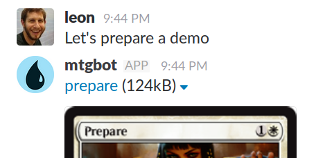

# MTGBot

MTGBot is a little [Slack][]bot that watches for mentions of [Magic the
Gathering (TM)][MTG] card names and responds with links to images of the cards.

MTGBot runs on [AppEngine][], and it's super small, so it will probably run
fine within Google's free tier (it certainly does for me).

MTGBot uses card data from [MTGJson][] to look up cards, and it links directly
to official Magic card images.

[Slack]: https://slack.com/
[MTG]: http://magic.wizards.com/
[AppEngine]: https://mtgjson.com://cloud.google.com/appengine/
[MTGJson]: https://mtgjson.com/

# Setup

1. [Tell Slack about your bot](https://api.slack.com/apps/).
2. Put the secret keys you got from Slack into `secrets.yaml.EDIT_ME` (and
   rename it to `secrets.yaml`).
3. Run `setup.sh`. (Use `pip` to install Python dependencies if needed.)
4. [Set up a Google Cloud Services account](https://cloud.google.com/).
5. [Install Google Cloud Services command-line tool](https://cloud.google.com/sdk/gcloud/).
6. Run `gcloud app deploy app.yaml --project $YOUR_PROJECT_NAME_HERE`.

# License

 
To the extent possible under law,
<a rel="dct:publisher"
    href="https://github.com/leonbarrett/">
  Leon Barrett</a>
has waived all copyright and related or neighboring rights to
MTGBot.
This work is published from:

United States.
